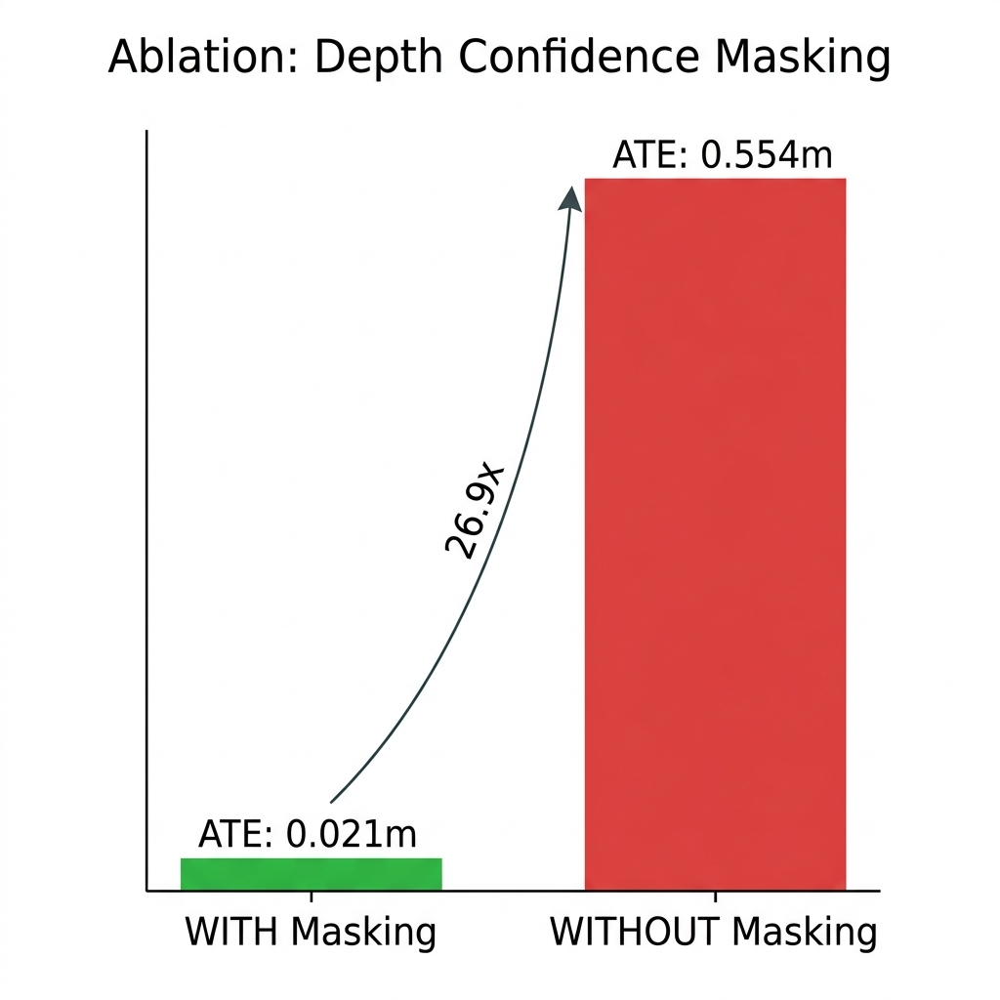
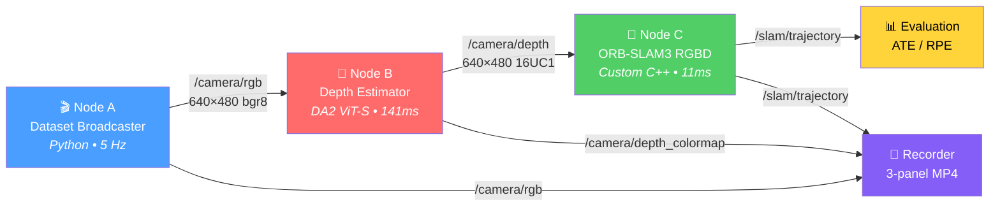
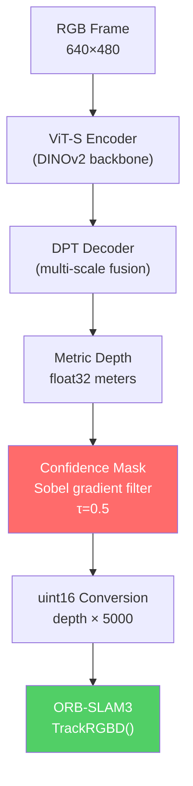

# Pseudo RGB-D SLAM — Neural Depth × ORB-SLAM3

> Replace a physical depth sensor with a neural network. Run ORB-SLAM3 on the predicted depth. See how much you lose.

A modular ROS2 pipeline that swaps out the Microsoft Kinect with [Depth Anything V2](https://depth-anything-v2.github.io/) (Metric Indoor Small) and feeds the predicted depth into [ORB-SLAM3](https://github.com/UZ-SLAMLab/ORB_SLAM3) for visual SLAM. Built and validated on TUM fr1/desk.

---

### 🎥 Demo

> 3-panel visualization: **RGB** | **Neural Depth** (MAGMA colormap) | **Real-time Trajectory**

https://github.com/user-attachments/assets/a4f2821e-6946-407c-9332-792b0649360e

---

### ⚡ Key Results

| Metric | Pseudo RGB-D | Real Kinect | Ratio |
|---|---|---|---|
| **ATE RMSE** | **0.0206 m** | ~0.016 m | **1.3×** |
| **RPE Translation** | 0.0111 m/frame | — | — |
| **RPE Rotation** | 0.422 °/frame | — | — |
| **Depth Inference** | 141ms (7.1 FPS) | Hardware | — |
| **SLAM Tracking** | 11ms (~90 FPS) | — | — |
| **Tracking Success** | 98.3% (118/120) | — | — |

**1.3× degradation vs a real depth sensor — neural depth works for SLAM.**

### 🔬 Ablation: Confidence Masking is Critical

Filtering just ~0.2% of pixels at depth boundaries makes a **26.9× difference** in accuracy:



| | WITH Masking (τ=0.5) | WITHOUT Masking | Improvement |
|---|---|---|---|
| **ATE RMSE** | 0.0206 m | 0.5536 m | **26.9×** |
| **RPE Rot** | 0.42°/frame | 6.79°/frame | **16.1×** |

> **Takeaway:** You can't just pipe raw neural depth into SLAM. Boundary artifacts from the DPT decoder corrupt the 3D map and crash the optimizer.

---

## Architecture



**Pipeline throughput:** 7.1 FPS (bottleneck: DA2 depth inference on GTX 1650)

### ROS2 Topics

| Topic | Type | Description |
|---|---|---|
| `/camera/rgb` | `Image` (bgr8) | RGB frames from TUM dataset |
| `/camera/depth_predicted` | `Image` (16UC1) | Neural metric depth (×5000) |
| `/camera/depth_colormap` | `Image` (bgr8) | Colorized depth visualization |
| `/slam/camera_pose` | `PoseStamped` | Current camera pose in SE(3) |
| `/slam/trajectory` | `Path` | Full trajectory for evaluation |
| `/slam/map_points` | `PointCloud2` | Sparse 3D map |

---

## Key Design Decisions

### 🧠 Depth Model: DA2 Metric Indoor Small



| Property | Value |
|---|---|
| **Output** | Metric depth in meters (float32) |
| **Backbone** | ViT-S (DINOv2), ~25M parameters |
| **Training** | Hypersim synthetic indoor dataset |
| **Speed** | 141ms/frame (GPU) · 467ms (CPU) |

Why not Metric3D v2? 2.5× slower. Why not ZoeDepth? Weak on indoor scenes. Why not UniDepthV2? Too big for the 2GB GPU constraint.

### 📍 SLAM: ORB-SLAM3 (RGB-D Mode)

ORB-SLAM3 is ORB-SLAM2's direct successor by the same team. The RGB-D tracking pipeline is identical: ORB features → depth backprojection → PnP + RANSAC → Bundle Adjustment on SE(3) → DBoW2 loop closing. I wrote a custom C++ ROS2 wrapper from scratch rather than using off-the-shelf wrappers.

### 🔒 Depth Confidence Masking

Neural depth is noisiest at object boundaries. I compute the Sobel gradient of the depth map as a confidence proxy and zero out high-gradient regions (depth=0 tells ORB-SLAM3 to ignore the pixel). Ablation showed this is **essential** — see results above.

---

## Quick Start

### Prerequisites
- Windows 11 + WSL2 (Ubuntu 22.04/24.04)
- NVIDIA GPU (GTX 1650 or better, 4GB+ VRAM)
- Docker + NVIDIA Container Toolkit

### 1. Build Docker Image
```bash
cd pseudo_rgbd_slam/docker
docker compose build    # ~30-45 minutes
```

### 2. Download TUM Dataset
```bash
docker compose run pseudo_slam bash scripts/download_tum_dataset.sh /data
```

### 3. Build ROS2 Package
```bash
docker compose run pseudo_slam bash -c "
    source /opt/ros/humble/setup.bash
    cd /ros2_ws
    colcon build --symlink-install
    source install/setup.bash
"
```

### 4. Run Pipeline
```bash
# Launch all 3 nodes
docker compose run pseudo_slam bash -c "
    source /opt/ros/humble/setup.bash
    source /ros2_ws/install/setup.bash
    ros2 launch pseudo_rgbd_slam pseudo_slam.launch.py
"
```

### 5. Evaluate
```bash
python3 evaluation/trajectory_eval.py \
    --gt /data/rgbd_dataset_freiburg1_desk/groundtruth.txt \
    --est /data/trajectory_pseudo.txt
```

---

## Project Structure

```
pseudo_rgbd_slam/
├── docker/
│   ├── Dockerfile                    # CUDA + ROS2 Humble + ORB-SLAM3 + DA2
│   └── docker-compose.yml
├── config/
│   └── TUM1.yaml                     # ORB-SLAM3 config (fr1 Kinect intrinsics)
├── launch/
│   └── pseudo_slam.launch.py        # Orchestrates all 3 nodes
├── pseudo_rgbd_slam/
│   ├── node_a_broadcaster.py        # Node A: TUM dataset reader
│   ├── node_b_depth_estimator.py    # Node B: DA2 depth + confidence masking
│   └── record_demo.py               # 3-panel video recorder
├── src/
│   └── node_c_pseudo_slam.cpp       # Node C: ORB-SLAM3 C++ wrapper
├── evaluation/
│   └── trajectory_eval.py           # ATE/RPE with Umeyama alignment
├── assets/                           # Images for README
├── report/
│   └── report.md                    # Full technical report with math
├── demo.mp4                          # Screen recording
├── CMakeLists.txt                    # Mixed C++/Python ament_cmake build
└── README.md
```

---

## Mathematical Background

See [report/report.md](report/report.md) for full derivations including:
- Pinhole backprojection & depth conversion math
- SE(3) vs Sim(3) analysis for pseudo RGB-D
- Huber kernel connection to neural depth noise
- DPT architecture breakdown
- Real-time feasibility analysis with Jetson projections

---

## Related Work

This project builds on my earlier **Aerial Guardian** drone MOT work (same assignment series), where I implemented:
- ORB feature extraction + RANSAC affine estimation for camera motion compensation
- Real-time perception on Jetson Orin Nano (14.5–36.9 FPS with TensorRT)
- Modular pipeline with ablation studies

The ORB pipeline in Aerial Guardian's `camera_motion.py` is essentially the same thing ORB-SLAM3's frontend does — same FAST corners, same binary descriptors, same Hamming matching, same RANSAC.

---

## License

MIT
