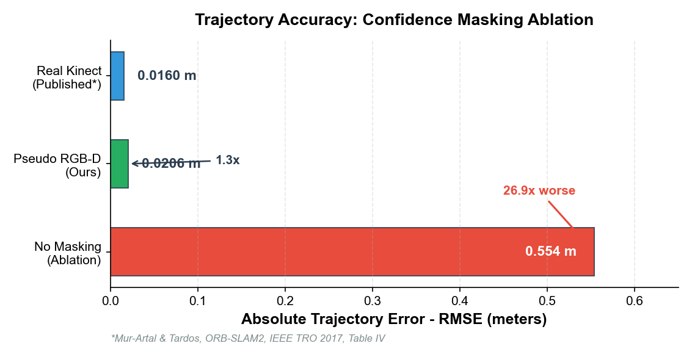
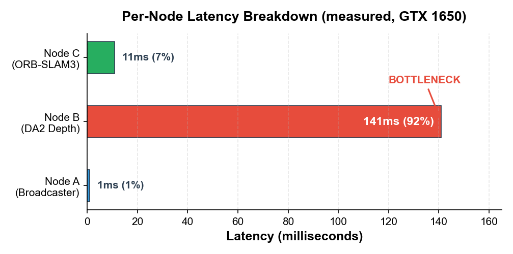
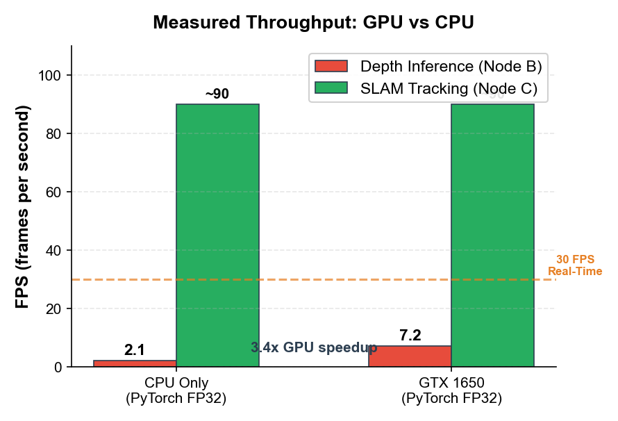
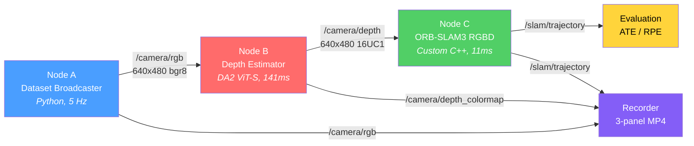
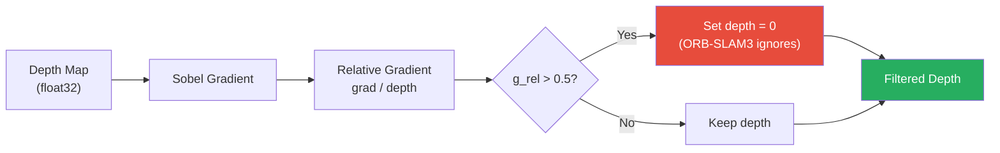

# Pseudo RGB-D SLAM — Neural Depth x ORB-SLAM3

> Replace a physical depth sensor with a neural network. Run ORB-SLAM3 on the predicted depth. See how much you lose.

A modular ROS2 pipeline that swaps out the Microsoft Kinect with [Depth Anything V2](https://depth-anything-v2.github.io/) (Metric Indoor Small) and feeds the predicted depth into [ORB-SLAM3](https://github.com/UZ-SLAMLab/ORB_SLAM3) for visual SLAM. Built and validated on TUM fr1/desk.

---

## Demo

> 3-panel visualization: **RGB** | **Neural Depth** (MAGMA colormap) | **Real-time Trajectory**

https://github.com/user-attachments/assets/a4f2821e-6946-407c-9332-792b0649360e

---

## Results

### Trajectory Accuracy



| Metric | Pseudo RGB-D | Real Kinect (Published) | Ratio |
|---|---|---|---|
| **ATE RMSE** | **0.0206 m** | ~0.016 m | 1.3x |
| **RPE Translation** | 0.0111 m/frame | -- | -- |
| **RPE Rotation** | 0.422 deg/frame | -- | -- |
| **Tracking Success** | 98.3% (118/120) | -- | -- |
| **Map Points** | 975 | -- | -- |

**1.3x degradation vs real depth sensor.** Neural depth is viable for SLAM.

### Ablation: Confidence Masking

Filtering ~0.2% of pixels at depth boundaries makes a **26.9x difference**:

| | WITH Masking | WITHOUT Masking | Change |
|---|---|---|---|
| **ATE RMSE** | 0.0206 m | 0.5536 m | **26.9x** |
| **RPE Rot** | 0.42 deg/frame | 6.79 deg/frame | **16.1x** |
| **Scale** | 0.5076 | 0.2165 | -- |

Without masking, boundary artifacts from the DPT decoder corrupt the 3D map and the system essentially fails.

### Performance (Measured)





Pipeline bottleneck is depth inference (92% of total latency). SLAM tracking at ~90 FPS is never the limiting factor.

| Config | Depth FPS | Pipeline FPS | Measured? |
|---|---|---|---|
| **GTX 1650 (FP32)** | **7.2** | **7.1** | Yes |
| CPU only (FP32) | 2.1 | 2.1 | Yes |
| GPU speedup | -- | **3.4x** | Yes |

---

## Architecture



---

## Design Decisions

### Depth Model: DA2 Metric Indoor Small

| Property | Value |
|---|---|
| **Output** | Metric depth in meters (float32) |
| **Backbone** | ViT-S (DINOv2), ~25M parameters |
| **Training** | Hypersim synthetic indoor |
| **Speed** | 141ms/frame (GPU), 467ms (CPU) |

Why not Metric3D v2? 2.5x slower. Why not UniDepthV2? Too big for 2GB GPU constraint.

### Depth Confidence Masking



~0.2% of pixels filtered. **26.9x ATE improvement** (validated via ablation).

### SLAM: ORB-SLAM3 (RGB-D Mode)

ORB-SLAM3 is ORB-SLAM2's direct successor by the same team. I wrote a custom C++ ROS2 wrapper from scratch that calls `TrackRGBD()` and publishes poses, trajectory, and map points.

---

## Quick Start

```bash
# Clone and build
git clone https://github.com/pratap424/pseudo_rgbd_slam.git
cd pseudo_rgbd_slam/docker
docker compose build          # ~30-45 min

# Start container
docker compose up -d
docker exec -it slam_dev bash

# Inside container
source /opt/ros/humble/setup.bash
cd /ros2_ws && colcon build --symlink-install
source install/setup.bash

# Terminal 1: Node A
ros2 run pseudo_rgbd_slam node_a --ros-args \
    -p dataset_path:=/data/rgbd_dataset_freiburg1_desk -p publish_rate:=5.0

# Terminal 2: Node B
ros2 run pseudo_rgbd_slam node_b --ros-args -p device:=cuda

# Terminal 3: Node C
export LD_LIBRARY_PATH=/opt/ORB_SLAM3/lib:$LD_LIBRARY_PATH
ros2 run pseudo_rgbd_slam node_c_pseudo_slam --ros-args \
    -p use_viewer:=false -p save_trajectory:=true

# Evaluate
python3 evaluation/trajectory_eval.py \
    --gt /data/rgbd_dataset_freiburg1_desk/groundtruth.txt \
    --est /data/trajectory_pseudo.txt
```

---

## Project Structure

```
pseudo_rgbd_slam/
├── docker/Dockerfile              # CUDA + ROS2 + ORB-SLAM3 + DA2
├── config/TUM1.yaml               # ORB-SLAM3 intrinsics
├── pseudo_rgbd_slam/
│   ├── node_a_broadcaster.py      # Node A: TUM dataset reader
│   ├── node_b_depth_estimator.py  # Node B: DA2 depth + masking
│   └── record_demo.py             # 3-panel video recorder
├── src/node_c_pseudo_slam.cpp     # Node C: ORB-SLAM3 C++ wrapper
├── evaluation/trajectory_eval.py  # ATE/RPE with Umeyama alignment
├── report/report.md               # Full technical report
├── assets/                        # Generated figures
└── demo.mp4                       # Screen recording
```

See [report/report.md](report/report.md) for full technical report with mathematical derivations, scale bias analysis, and drone deployment considerations.

---

## License


